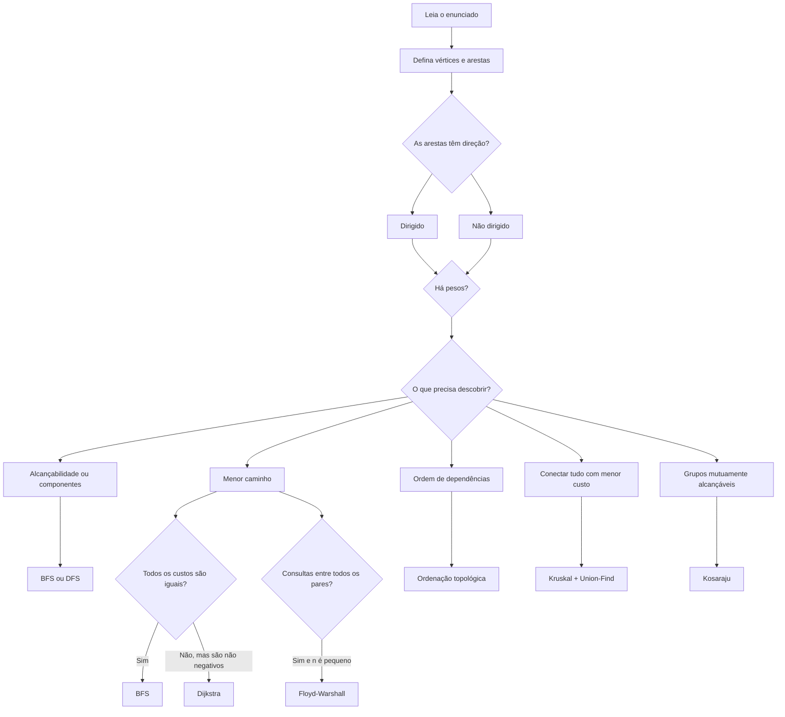

# Guia prático para resolver questões de grafos

Resolver uma questão de grafos fica mais simples quando você separa o trabalho
em três decisões: **o que são os vértices e as arestas**, **qual resposta o
problema pede** e **qual algoritmo entrega essa resposta dentro dos limites**.

Você não deve começar procurando um algoritmo pelo nome. Primeiro traduza o
enunciado para um grafo; depois escolha a ferramenta.

## O mapa mental



## 1. Traduza o problema antes de programar

Responda estas perguntas no papel:

1. **O que é um vértice?** Cidade, curso, funcionário, célula ou planeta?
2. **O que é uma aresta?** Estrada, requisito, relação ou movimento?
3. **A aresta é dirigida?** `a -> b` é diferente de `b -> a`?
4. **Existe peso?** Distância, custo ou tempo?
5. **O que deve ser impresso?** Existência, quantidade, custo, ordem ou caminho?
6. **Quais são os limites?** Eles eliminam algum algoritmo lento?

Exemplo: em **Contando Salas**, cada `.` é um vértice e existe uma aresta entre
duas células livres vizinhas. Uma sala é uma componente conexa. A grade é apenas
uma forma compacta de descrever esse grafo.

## 2. Escolha a representação

### Lista de adjacência

Use na maioria dos problemas. Para a aresta dirigida `a -> b`:

```python
grafo = [[] for _ in range(n)]
grafo[a].append(b)
```

Para uma aresta não dirigida:

```python
grafo[a].append(b)
grafo[b].append(a)
```

Para uma aresta ponderada:

```python
grafo[a].append((b, custo))
```

Assim, `grafo[v]` é a lista dos vizinhos alcançáveis diretamente a partir de
`v`. O laço abaixo percorre exatamente essas arestas:

```python
for vizinho in grafo[vertice]:
    processar(vizinho)
```

### Grafo implícito em uma grade

Não é necessário montar listas de vizinhos. Você calcula as quatro posições
possíveis durante a busca:

```python
for dx, dy in ((1, 0), (-1, 0), (0, 1), (0, -1)):
    nx, ny = x + dx, y + dy
```

Antes de visitar `(nx, ny)`, confirme os limites, a ausência de parede e se a
célula ainda não foi visitada.

### Matriz de adjacência

Uma matriz `n x n` gasta `O(n²)` de memória. Use apenas quando `n` for pequeno
ou quando o algoritmo realmente precisar de distâncias entre todos os pares,
como Floyd-Warshall.

## 3. Reconheça o algoritmo pela pergunta

| Sinal no enunciado | Algoritmo provável | Condição importante |
|---|---|---|
| “Existe caminho?” | BFS ou DFS | Pesos não importam |
| “Quantos grupos/regiões?” | BFS ou DFS | Conte novas buscas |
| “Menor número de movimentos” | BFS | Cada movimento custa o mesmo |
| “Menor custo/distância” | Dijkstra | Pesos não negativos |
| “Várias consultas entre pares” | Floyd-Warshall | `n` pequeno, normalmente até 500 |
| “A deve vir antes de B” | Ordenação topológica | Grafo dirigido sem ciclo |
| “Todos alcançam todos?” | Grafo e grafo reverso | Duas buscas a partir de um vértice |
| “Grupos mutuamente alcançáveis” | Kosaraju | Componentes fortemente conexos |
| “Conectar tudo com menor custo” | Kruskal | Grafo não dirigido ponderado |
| “Hierarquia sem ciclos” | DFS em árvore | Use pai e pós-ordem quando necessário |

## 4. Padrões fundamentais

### BFS e DFS para componentes

Ao varrer todos os vértices, cada vértice não visitado inicia uma nova
componente:

```python
componentes = 0

for inicio in range(n):
    if not visitado[inicio]:
        componentes += 1
        busca(inicio)
```

O primeiro vértice não é a componente inteira: ele é o representante que
inicia uma busca. A busca marca todos os vértices pertencentes ao mesmo grupo.

Use esse padrão em:

- salas e regiões de uma grade;
- cidades que já estão conectadas;
- construção de estradas entre componentes.

Veja `lista-4/exercicios-grafos/01-buscas-e-grades/01.py` e
`lista-4/problemas-vjudge/01_building_roads.py`.

### BFS para menor caminho sem pesos

A BFS explora por camadas: distância 0, depois 1, depois 2. Por isso, a primeira
vez que um vértice é descoberto corresponde ao menor número de arestas desde o
início.

Marque como visitado ao inserir na fila:

```python
visitado[vizinho] = True
pai[vizinho] = vertice
fila.append(vizinho)
```

Marcar somente ao retirar permite que vários vértices coloquem o mesmo vizinho
na fila.

Se o problema pede os movimentos, guarde o pai ou a direção. A busca começa no
início, mas a reconstrução começa no destino:

```text
busca:          início -> ... -> destino
reconstrução:   destino -> ... -> início
resultado:      reverse(reconstrução)
```

Veja `lista-4/exercicios-grafos/01-buscas-e-grades/02.py`.

### BFS com várias fontes

Quando existem vários monstros, incêndios ou fontes de contaminação, coloque
todos na fila inicialmente. Uma única BFS calcula o primeiro instante em que
qualquer fonte alcança cada posição.

Depois, o jogador só pode entrar em uma célula se chegar estritamente antes:

```python
tempo_jogador + 1 < tempo_monstro[nx][ny]
```

Veja `lista-4/exercicios-grafos/01-buscas-e-grades/03.py`.

### Ordenação topológica

Para cada aresta `a -> b`, aumente `indegree[b]`. Os vértices com grau de
entrada zero não possuem dependências pendentes.

```python
for origem, destino in arestas:
    grafo[origem].append(destino)
    indegree[destino] += 1
```

Ao processar um vértice, suas arestas deixam de ser dependências pendentes:

```python
for vizinho in grafo[vertice]:
    indegree[vizinho] -= 1
    if indegree[vizinho] == 0:
        fila.append(vizinho)
```

Se menos de `n` vértices forem processados, existe um ciclo. Veja
`lista-4/exercicios-grafos/02-ordenacao-topologica/05.py`.

### Dijkstra

Dijkstra mantém a melhor distância conhecida e sempre retira da fila de
prioridade o menor candidato.

```python
nova = distancia_atual + peso
if nova < distancia[vizinho]:
    distancia[vizinho] = nova
    heapq.heappush(fila, (nova, vizinho))
```

Uma distância pode ser melhorada depois de uma versão antiga já ter entrado na
fila. Ignore entradas desatualizadas:

```python
if distancia_atual != distancia[vertice]:
    continue
```

Dijkstra não deve ser usado com pesos negativos. Para reconstruir o caminho,
guarde `pai[vizinho] = vertice` sempre que melhorar a distância.

Veja `lista-4/exercicios-grafos/03-menores-caminhos/06.py` e
`lista-4/problemas-vjudge/04_dijkstra.py`.

### Floyd-Warshall

Floyd-Warshall tenta usar cada vértice `k` como intermediário entre todos os
pares `(i, j)`:

```python
dist[i][j] = min(dist[i][j], dist[i][k] + dist[k][j])
```

Ele custa `O(n³)` e guarda uma matriz `O(n²)`. É adequado para centenas de
vértices, não para `n = 100000`.

Veja `lista-4/exercicios-grafos/03-menores-caminhos/08.py`.

### Grafo reverso e Kosaraju

O grafo reverso troca `a -> b` por `b -> a`. Ele responde perguntas sobre quem
consegue chegar até um destino e é a segunda metade do algoritmo de Kosaraju.

Kosaraju faz:

1. DFS no grafo original, guardando a ordem de término;
2. DFS no grafo reverso, seguindo a ordem de término invertida;
3. cada nova DFS da segunda etapa cria uma componente fortemente conexa.

Veja `lista-4/exercicios-grafos/04-conectividade-direcionada/09.py` e
`lista-4/exercicios-grafos/04-conectividade-direcionada/10.py`.

### Kruskal e Union-Find

Kruskal ordena as arestas pelo custo e aceita apenas as que unem componentes
diferentes. Union-Find responde rapidamente se dois vértices já pertencem ao
mesmo componente.

```python
for custo, a, b in sorted(arestas):
    if encontrar(a) != encontrar(b):
        unir(a, b)
        custo_total += custo
```

Uma árvore que conecta `n` vértices possui exatamente `n - 1` arestas. Se
Kruskal terminar com menos, era impossível conectar todo o grafo.

Veja `lista-4/exercicios-grafos/05-arvore-geradora-minima/11.py`.

### DFS em árvores

Uma árvore conectada com `n` vértices possui `n - 1` arestas. Como não existem
ciclos, normalmente basta guardar o pai para não voltar pela mesma aresta.

Quando a decisão do pai depende dos filhos, processe em pós-ordem: primeiro os
descendentes, depois o vértice atual. Veja
`lista-4/exercicios-grafos/06-arvores-e-componentes/12.py`.

## 5. Use os limites para eliminar soluções erradas

| Complexidade | Escala aproximada adequada |
|---|---|
| `O(n + m)` | Centenas de milhares de vértices e arestas |
| `O((n + m) log n)` | Grafos grandes com pesos |
| `O(n²)` | Alguns milhares, dependendo da constante |
| `O(n³)` | Normalmente algumas centenas |

Esses valores são orientação, não promessa. Memória, linguagem e limite de
tempo também importam.

Se `n = 100000`, uma matriz `n x n` é inviável. Se `n = 500`, Floyd-Warshall
pode ser exatamente o algoritmo esperado.

## 6. Prove para você mesmo por que funciona

Antes de finalizar, complete uma frase sobre a garantia do algoritmo:

- **BFS:** “processo primeiro todos os caminhos com menos arestas”.
- **Dijkstra:** “com pesos não negativos, o menor candidato retirado não será
  melhorado por um caminho futuro”.
- **Kahn:** “grau zero significa que nenhuma dependência ainda impede o
  vértice”.
- **Kruskal:** “a menor aresta que une componentes diferentes pode ser aceita
  sem criar ciclo”.
- **Kosaraju:** “a ordem de término impede que a segunda etapa misture
  componentes distintas”.

Se você não consegue completar a frase, provavelmente ainda está usando o
algoritmo pelo formato do código, não pela lógica do problema.

## 7. Checklist de implementação

Antes de executar:

- confirme se os vértices da entrada começam em 1 e converta para índice 0;
- em grafo não dirigido, adicione a aresta nos dois sentidos;
- em grafo ponderado, guarde `(vizinho, peso)`;
- inicialize todas as estruturas com exatamente `n` posições;
- marque o visitado quando inserir na fila ou pilha;
- não use recursão profunda em Python para `n` grande;
- use `sys.stdin.buffer.readline` quando a entrada for grande.

Depois de implementar:

- teste um único vértice;
- teste um grafo desconectado;
- teste um ciclo quando o algoritmo exige DAG;
- teste arestas repetidas quando permitidas;
- teste dois caminhos, um com menos arestas e outro com menor custo;
- teste se o destino é inalcançável;
- confirme se a saída pede distância ou o caminho completo.

## 8. Erros que parecem pequenos, mas quebram a solução

### Confundir `n` e `m`

`n` costuma ser o número de vértices e `m`, o número de arestas. A leitura usa:

```python
for _ in range(m):
    ler_aresta()
```

### Inverter linhas e colunas

Uma grade com `n` linhas e `m` colunas precisa de:

```python
visitado = [[False] * m for _ in range(n)]
```

### Usar BFS em pesos diferentes

BFS minimiza a quantidade de arestas, não a soma dos pesos. Use Dijkstra quando
os custos são diferentes e não negativos.

### Esquecer vértices de grau zero

Na ordenação topológica, `indegree` deve começar com `n` zeros. Um dicionário
contendo apenas destinos perde justamente os vértices que precisam iniciar a
fila.

### Retornar antes do fim da busca

Detecção de ciclo e validação de quantidade normalmente acontecem depois do
`while`, não dentro dele.

## 9. Ordem sugerida para praticar

1. Contando Salas: componentes em grade;
2. Labirinto: BFS e reconstrução;
3. Building Roads: componentes em lista de adjacência;
4. Course Schedule: ordenação topológica;
5. Rotas Mínimas I: Dijkstra;
6. Dijkstra?: reconstrução em grafo ponderado;
7. Rotas Mínimas II: Floyd-Warshall;
8. Road Reparation: Kruskal;
9. Verificação de Rotas: grafo reverso;
10. Planetas e Reinos: Kosaraju;
11. Monstros e Planets: variações avançadas de menor caminho.

Use os índices `lista-4/exercicios-grafos/README.md` e
`lista-4/problemas-vjudge/README.md` para acessar enunciados e soluções.

## 10. Procedimento para uma questão nova

Quando receber um problema desconhecido, siga esta ordem:

1. escreva em uma frase o que são vértices e arestas;
2. marque se o grafo é dirigido, ponderado ou uma árvore;
3. escreva exatamente o que deve ser minimizado, contado ou ordenado;
4. confira os limites;
5. escolha o algoritmo pela garantia necessária;
6. faça um exemplo manual com até cinco vértices;
7. implemente a representação;
8. implemente o núcleo do algoritmo;
9. acrescente reconstrução ou formatação somente se a saída exigir;
10. teste os casos de borda antes de submeter.

O objetivo não é decorar dez programas. É reconhecer que problemas diferentes
pedem uma das poucas garantias fundamentais: explorar uma componente, avançar
por camadas, relaxar distâncias, respeitar dependências ou unir componentes sem
criar ciclos.
